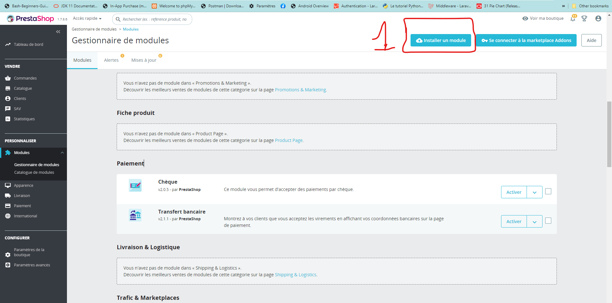
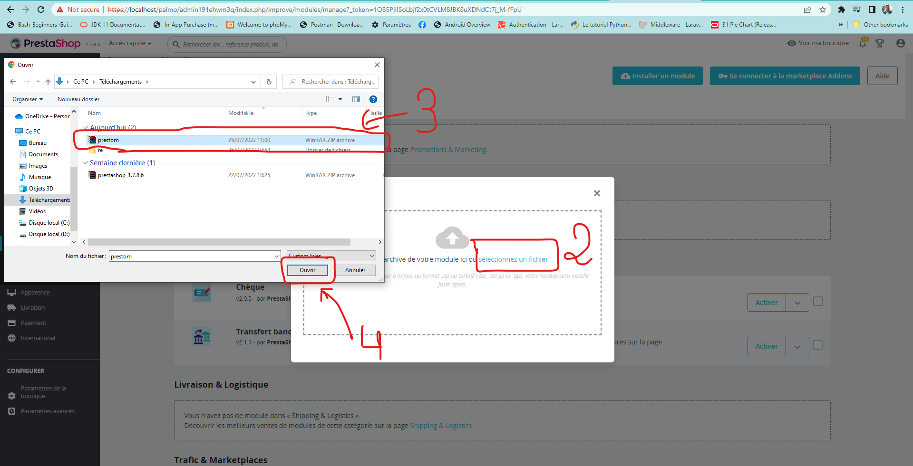
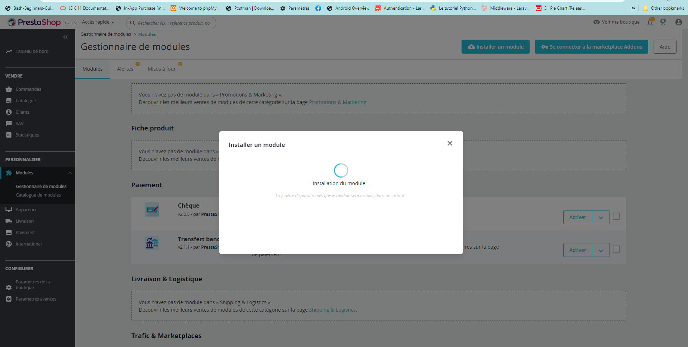
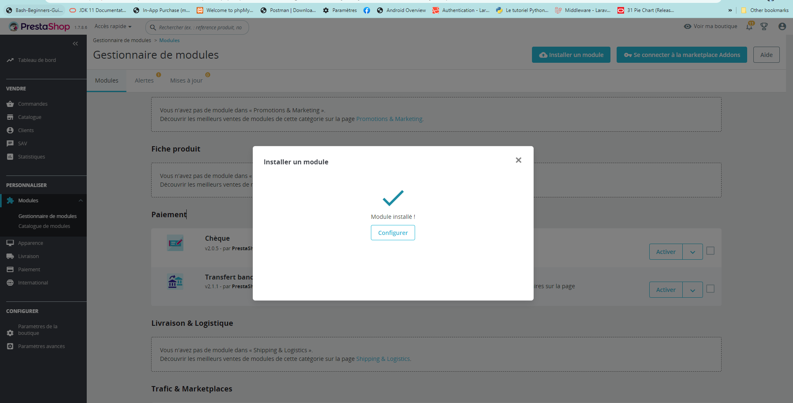
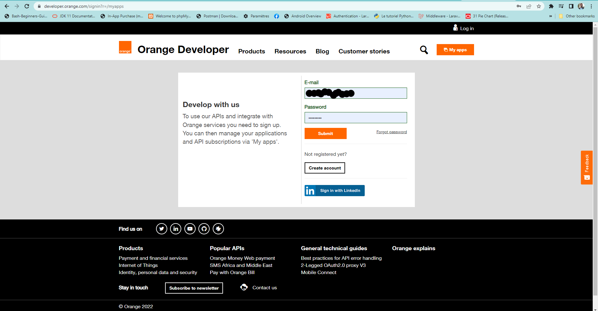
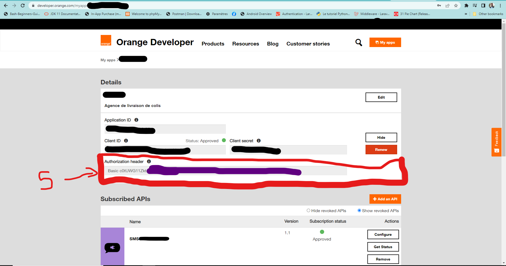
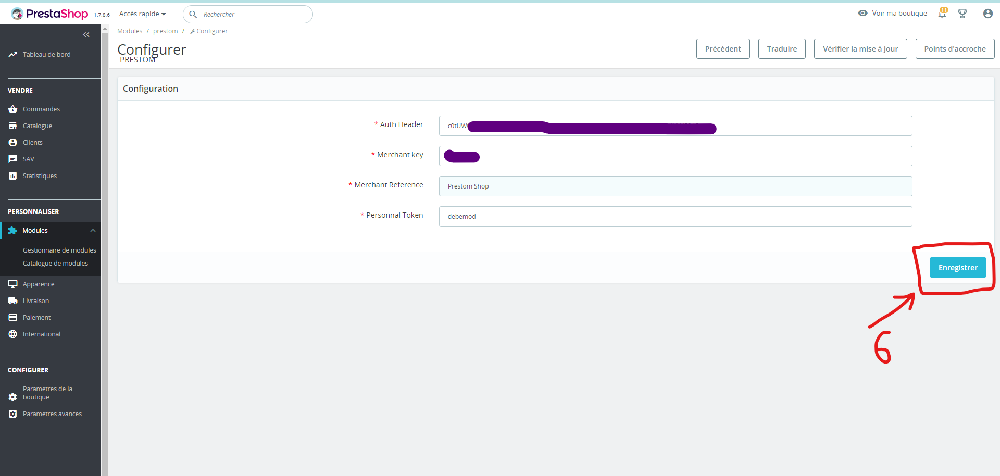
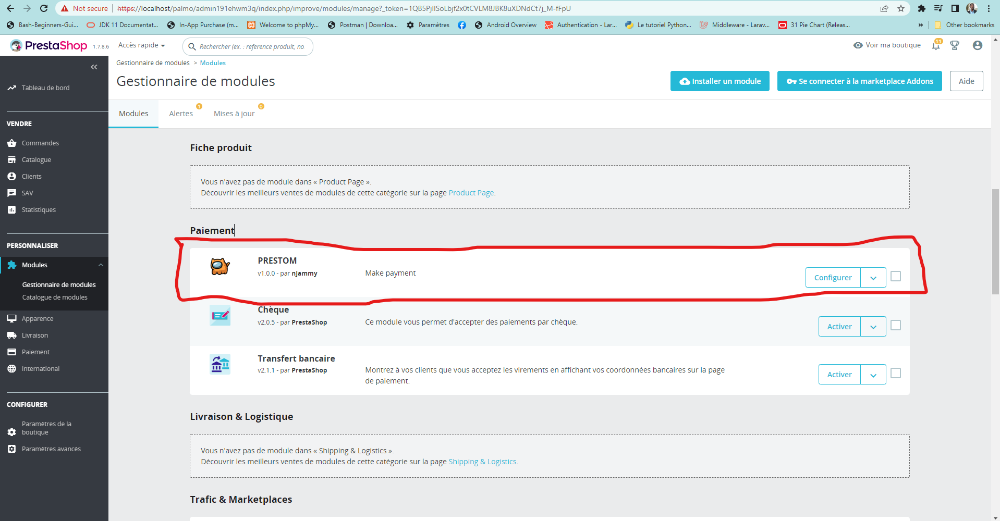
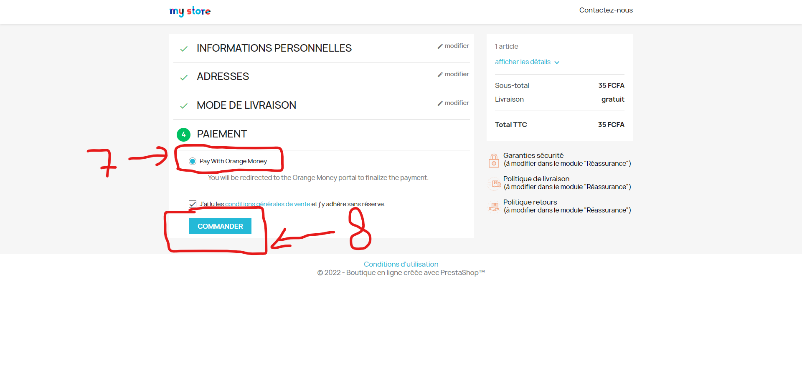
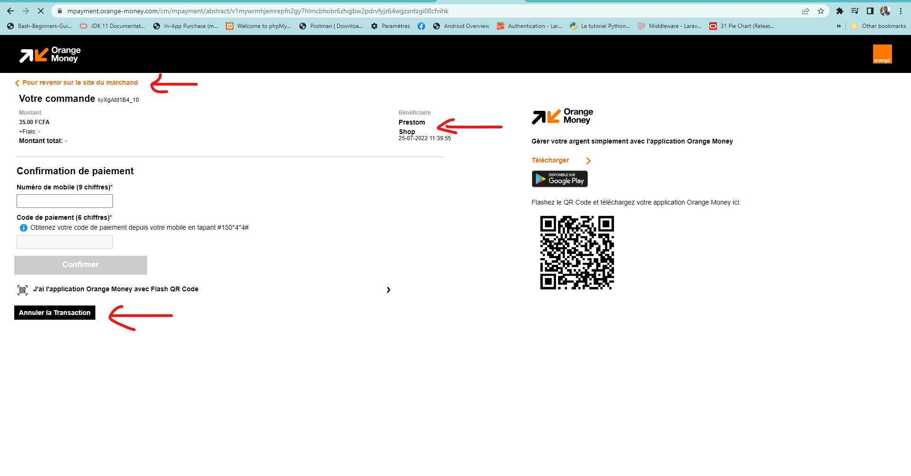

# PRESTOM

## _Prestashop module for Orange Money web payment in Central Africa_


Prestom is a basic prestahop module which allow shop owner to integrate Orange Money web payment on platform.

Prestom is compatible with Prestashop 1.7.8.6

## FEATURES

- Set Shop and Orange developer to Configuration module
- Pay order via Orange Web portal

## ADMIN DEMO

    Download prestashop module repos directory /setup/prestom.zip

















## SHOP CUSTOMER DEMO





## FOR DEVELOPER

    Requirement env
    - PHP VERSION 7.3.23
    - COMPOSER VERSION 2.3.9

Clone the repos
```sh
git clone https://github.com/njammy/prestom.git
```

Setup and load dependencies
```sh
cd prestom && composer install && composer dump-autoload
```

## Author

- [njammy](https://github.com/njammy)

## License

- MIT

**Free Software, Hell Yeah!**